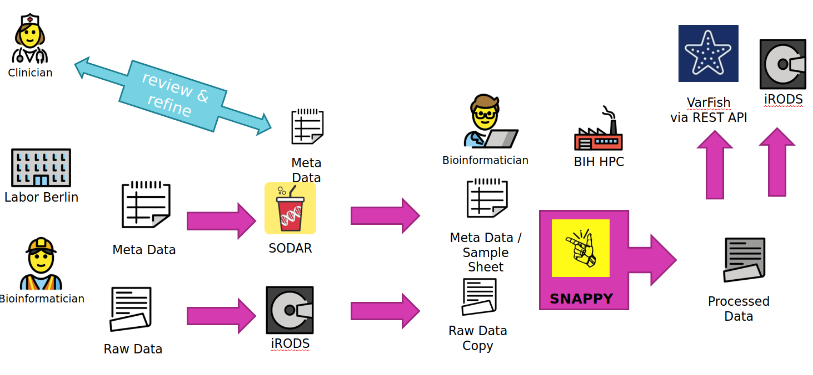

.. _usecase_exomes:

================
Use Case: Exomes
================

This section describes the cubi-tk use case for exomes that are sequenced at Labor Berlin and processed by CUBI.
This section provides an outline of how cubi-tk helps in connecting

- SODAR (the CUBI system for meta and mass data storage and management),
- SNAPPY (the CUBI pipeline for the processing of DNA sequencing, including exomes),
- and VarFish (the CUBI web app for interactive analysis and annotation of variant calling results).

--------
Overview
--------

The overall data flow for the Translate-NAMSE use case is depicted below.

- A Labor Berlin (LB) bioinformatician uses "cubi-tk sodar add-ped" to augment the sample sheet of a SODAR project with new family members or new families alltogether.
  He also transfers the FASTQ read data sequences to the iRODS system that backs SODAR for file storage.
- At this stage, a Charite geneticist can review and refine the sample sheet.
  This mostly relates to information that is secondary for the subsequent analysis.
  It is assumed that the family relations updated by the bioinformatician are correct (two parents of a sample are the two parents, if father and mother are flipped, this is not important for analysis by SNAPPY).
- A CUBI Bioinformatician can now update the sample sheet for the SNAPPY pipeline using "cubi-tk snappy pull-sheets" and update a copy of the raw data sequence with "cubi-tk snappy pull-raw-data" files earlier transferred by LB.
- Once the data has been pulled from SODAR and iRODS, the CUBI bioinformatician launches the SNAPPY pipeline which processes the data on the BIH HPC.
  The command ``cubi-tk snappy kickoff`` launches the pipeline steps with their dependencies. Inspection of results is based on manual inspection of log files for now.
- Once this is complete, Manuel uses ``cubi-tk snappy varfish-upload`` and ``cubi-tk snappy itarnsfer-{variant-calling,ngs-mapping}`` to transfer the resulting BAM and VCF files into VarFish via its REST API and iRODS via landing zones (``cubi-tk sodar lz-{create,move}``).

**To summarise more concisely**

- LB copies data and meta data to SODAR/iRODS.
- CUBI pulls mass data and meta data form SODAR/iRODS and starts the pipeline.
- CUBI submits the resulting mass data results back into SODAR and annotated/exported variant calls into VarFish.
- The clinician can review the sample sheet independently of Manuel and Johannes.

**Human interaction is required if**

- The sample sheet does not sufficiently reflect reality (sample swaps)
- Files are broken and/or swapped.
- Tools terminate too early; data is not copied.
- Overall, this is not fully automated system, rather a system with heavy tool support and semi-automation.

**Future improvements are**

- Ask clinicians sending in samples for sex of child.
- Properly track parents as father/mother.

**More Notes**

- Data is processed in batches.
- Many tooling steps rely on “start processing in batch NUMBER”
- That is, everything behind NUMBER will be processed.
- Requires human-manual tracking of batch to start at (easy to seee in SODAR)

-----
Setup
-----

For token management for both VarFish and SODAR, the following docs can be used:

- https://sodar.bihealth.org/manual/ui_user_menu.html
- https://sodar.bihealth.org/manual/ui_api_tokens.html

1. Obtain a VarFish API token from the varfish system and configure ``~/.varfishrc.toml``.

    .. code-block:: toml

        [global]
        varfish_server_url = "https://varfish.bihealth.org/"
        varfish_api_token = "<your API token here>"

2. Obtain a SODAR API token and configure ``~/.cubitkrc.toml``.

    .. code-block:: toml

        [global]

        sodar_server_url = "https://sodar.bihealth.org/"
        sodar_api_token = "<your API token here>"

3. Create a new Miniconda installation if necessary.

    .. code-block:: bash

        host:~$ wget https://repo.anaconda.com/miniconda/Miniconda3-latest-Linux-x86_64.sh
        host:~$ bash Miniconda3-latest-Linux-x86_64.sh -b -p $HOME/miniconda3
        host:~$ source $HOME/miniconda3/bin/activate
        (conda) host:~$

4. Checkout and install VarFish CLI:

    .. code-block:: bash

        (conda) host:~$ git clone https://github.com/bihealth/varfish-cli.git
        (conda) host:~$ cd varfish-cli
        (conda) host:varfish-cli$ pip install -r requirements/base.txt
        (conda) host:varfish-cli$ pip install -e .

5. Checkout and install CUBI-TK

    .. code-block:: bash

        (conda) host:~$ git clone git@cubi-gitlab.bihealth.org:CUBI/Pipelines/cubi-tk.git
        (conda) host:~$ cd cubi-tk
        (conda) host:cubi-tk$ pip install -r requirements/base.txt
        (conda) host:cubi-tk$ pip install -e .

--------------------
SNAPPY Configuration
--------------------

You have to adjust the configuration of the SNAPPY data set as follows:

- You have ot provide the ``sodar_uuid`` attribute.
  Set it to the SODAR project's UUID.
- Data will be downloaded in the last entry of ``search_paths``.
    - If you are starting a new project then just use one entry with an appropriate value.
    - If you are moving a project to use cubi-tk then add a new entry where to download the data to.

.. code-block:: yaml

    # ...
    data_sets:
      "<the dataset name here>:
        sodar_uuid: "<dataset uuid here>
        sodar_title: "<optional title here>
        file: "<biomedsheets file path here>.tsv"
        type: germline_variants
        naming_scheme: only_secondary_id
        search_patterns:
        - {left: '**/*_R1.fastq.gz', right: '**/*_R2.fastq.gz'}
        - {left: '**/*_R1_*.fastq.gz', right: '**/*_R2_*.fastq.gz'}
        search_paths:
        - "<path to search data for here>"

Note that you will need the `**/*` in the pattern.

-------------------
Processing Commands
-------------------

The setup up to here only has to be done only once for each project/dataset.
The following step will (a) fetch the meta data and raw data from SODAR/iRODS, (b) start the processing with SNAPPY, and (c) submit the results back to SODAR once SNAPPY is done.

.. info:

    Most of the following commands will try to automatically find the configuration and sample sheet files to use.
    They will walk up the directory tree from the current working directory and look for a directory called ``.snappy_pipeline`` and use the configuration/sample sheets in there.

    For the ``itransfer`` commands this is not true yet but will be implemented in the near future.

First, you pull the meta data from SODAR with the command:

.. code-block:: bash

    $ cubi-tk snappy pull-sheets

This will show the changes that are to be applied in unified patch format and you have to confirm by files.
You can also add ``--yes --dry-run`` to see all pending changes at once without actually applying them or ``--yes`` to apply all changes.

The next step is to fetch the raw data from SODAR/iRODS.
You first have to authenticate with iRODS using ``init``.
You then fetch the raw data, optionally only the data starting at batch number ``$BATCH``.
You also have to provide the project UUID ``$PROJECT``.
Internally, cubi-tk will use the iRODS icommands and you will be shown the commands it is about to execute.

.. code-block:: bash

    $ iinit
    $ cubitk snappy pull-raw-data --min-batch $BATCH $PROJECT

Now you could start the processing.
However, it is advisable to ensure that the input FASTQ files can be linked in the ``ngs_mapping`` step.

.. code-block:: bash

    $ cd ngs_mapping
    $ snappy-snake -p $(snappy-snake -S | grep -v 'no update' | grep input_links | cut -f 1)

If this fails, a good starting point is removing ``ngs_mapping/.snappy_path_cache``.

You can kick off the current pipeline using

.. code-block:: bash

    $ cubi-tk snappy kickoff

After the pipeline has finished, you can create a new landing zone with the following command.
This will print the landing zone properties as JSON.
You will neded both the landing zone UUID (``ZONE``) and iRODS path (``$IRODS_PATH``) for now (in the future this will be simplified).

.. code-block:: bash

    $ cubi-tk sodar landing-zone-create $PROJECT

You can then transfer the data using the following commands.
You will have to specify the path to the SNAPPY sample sheet TSV as ``$TSV`` and the landing zone iRODS path ``$IRODS_PATH``.

.. code-block:: bash

    $ cubi-tk snappy itransfer-ngs-mapping --start-batch $BATCH $TSV $IRODS_PATH
    $ cubi-tk snappy itransfer-variant-calling --start-batch $BATCH $TSV $IRODS_PATH

Finally, you can validate and move the landing zone to get the data into SODAR:

.. code-block:: bash

    $ cubi-tk sodar landing-zone-move $ZONE

And last but not least, here is how to transfer the data into VarFish (starting at ``$BATCH``).

.. code-block:: bash

    $ cubi-tk snappy varfish-upload --min-batch $BATCH $PROJECT
