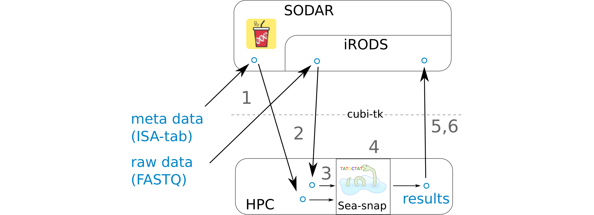

.. _usecase_single_cell:

=====================
Use Case: Single Cell
=====================

This section describes the cubi-tk use case for the analysis of single cell data.
It provides an outline of how cubi-tk helps in connecting

- Sea-Snap (the CUBI pipeline for the processing of RNA sequencing, including scRNA-seq),
- SODAR (the CUBI system for meta and mass data storage and management).

--------
Overview
--------

1 FASTQ and ISA-tab files are uploaded to SODAR.
   - ISA-tab files can be created with the help of ``cubi-tk isa-tpl isatab-single_cell``.
   - FASTQ files can be uploaded with the help of ``cubi-tk sodar ingest-fastq``
2 FASTQ and ISA-tab files are pulled from SODAR.
   - FASTQ files can be downloaded using ``cubi-tk sodar pull-raw-data`` or iRods icommands.
   - ISA-tab files can be downloaded using ``cubi-tk sea-snap pull-isa``.
3 A results folder is created on the HPC cluster and the config files are edited. A sample info file is created.
   - A results folder can be created with ``cubi-tk sea-snap working-dir``.
   - The sample_info.yaml file can be created with ``cubi-tk sea-snap write-sample-info``. This combines information from the parsed FASTQ folder structure and ISA-tab meta information.
4 Running the Sea-snap pipeline.
   - This is done as usual via ``./sea-snap sc --slurm c``.
5 The results are uploaded to SODAR.
   - Create a landing zone on SODAR with ``cubi-tk sodar lz-create``.
   - Create a blueprint of which files to upload with ``./sea-snap sc l export``.
   - Upload the results using the blueprint and ``cubi-tk itransfer-results``.
6 Check whether all files have been uploaded to SODAR correctly.
   - This can be done via ``cubi-tk sea-snap check-irods``.

-----
Setup
-----

For token management for SODAR, the following docs can be used:

- https://sodar.bihealth.org/manual/ui_user_menu.html
- https://sodar.bihealth.org/manual/ui_api_tokens.html

1. Obtain a SODAR API token and configure ``~/.cubitkrc.toml``.

    .. code-block:: toml

        [global]

        sodar_server_url = "https://sodar.bihealth.org/"
        sodar_api_token = "<your API token here>"

2. Create a new Miniconda installation if necessary.

    .. code-block:: bash

        host:~$ wget https://repo.anaconda.com/miniconda/Miniconda3-latest-Linux-x86_64.sh
        host:~$ bash Miniconda3-latest-Linux-x86_64.sh -b -p $HOME/miniconda3
        host:~$ source $HOME/miniconda3/bin/activate
        (conda) host:~$

3. Checkout and install CUBI-TK

    .. code-block:: bash

        (conda) host:~$ git clone git@cubi-gitlab.bihealth.org:CUBI/Pipelines/cubi-tk.git
        (conda) host:~$ cd cubi-tk
        (conda) host:cubi-tk$ pip install -r requirements/base.txt
        (conda) host:cubi-tk$ pip install -e .

-------------------
Processing Commands
-------------------

**Hint:** Also see the Seasnap single cell pipeline documentation `here <https://cubi-gitlab.bihealth.org/CUBI/Pipelines/sea-snap/-/blob/sc_pipeline/documentation/run_sc.md>`_.

First, you can pull the meta data from SODAR with the command:

.. code-block:: bash

    $ cubi-tk sea-snap pull-isa <project_uuid>

This will create a folder with ISA-tab files.
Alternatively, you can omit this step and automatically pull the files later.

The next step is to fetch the raw data from SODAR/iRODS.
You first have to authenticate with iRODS using ``iinit``.
Internally, cubi-tk will use the iRODS icommands and you will be shown the commands it is about to execute.

.. code-block:: bash

    $ iinit
    $ cubi-tk sodar pull-raw-data <project_uuid>

Create a working directory for the project results:

.. code-block:: bash

    $ cubi-tk sea-snap working-dir <path_to_seasnap_pipeline>

This will also copy relevant files and a config template into the new directory.
Edit the config files to adjust the pipeline execution to your needs.

Create a sample info file. This is equivalent to a sample sheet and summarizes information about the samples in yaml format.
A path pattern to the downloaded FASTQ files is needed, see Sea-snap doku:
https://cubi-gitlab.bihealth.org/CUBI/Pipelines/sea-snap/blob/master/documentation/prepare_input.md#fastq-files-folder-structure

.. code-block:: bash

    $ cubi-tk sea-snap write-sample-info --isa-assay <path_to_assay_file> <path_pattern_to_fastq>

This combines information from both the FASTQ folder structure (given via path pattern) and the ISA-tab meta data (given via ISA-assay file).
If ISA-tab files have not been downloaded yet, you can use the option ``--project-uuid <project_uuid>`` instead of ``--isa-assay`` to download them on-the-fly.

Now you can start the processing.
Run the Sea-snap pipeline as usual:

.. code-block:: bash

    $ ./sea-snap sc --slurm c <any snakemake options>
    $ ./sea-snap sc --slurm c export

After the pipeline has finished, you can create a new landing zone with the following command.
This will print the landing zone properties as JSON.
You will need the landing zone UUID (``ZONE``) in the next step.

.. code-block:: bash

    $ cubi-tk sodar landing-zone-create <project_uuid>

You can then transfer the data using the following commands.
You will have to specify the blueprint file generated by the export rule of sea-snap.

.. code-block:: bash

    $ cubi-tk sea-snap itransfer-results <blueprint_file> <landing_zone_uuid>

Finally, you can validate and move the landing zone to get the data into SODAR:

.. code-block:: bash

    $ cubi-tk sodar landing-zone-move <landing_zone_uuid>

You may check, whether everything was uploaded correctly using the following command:

.. code-block:: bash

    $ cubi-tk sea-snap check-irods <path_to_local_results_folder> <irods_path_to_results_on_sodar>
